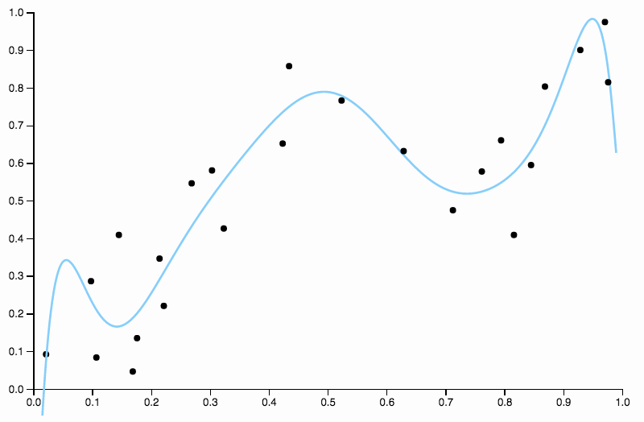
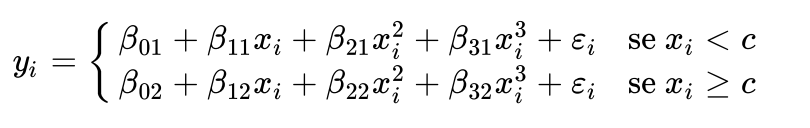
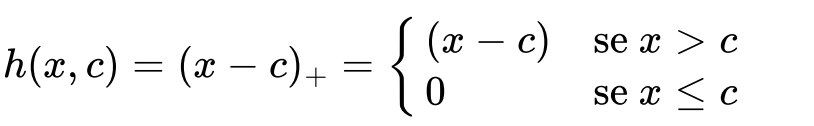

```{r setup, include=FALSE}
knitr::opts_chunk$set(echo = TRUE)
```

# Introduzione
Prima di discutere della struttura dell'algoritmo di smoothing splines, occorre introdurre dei concetti e strumenti fondamentali utili alla discussione del metodo, partendo dal definire il problema della regressione.

## Il problema della regressione
<p>In generale un problema di regressione ha l'obiettivo di stimare un modello che descriva uan relazione  tra una **variabile di risposta** $Y$  è un insieme di **variabili predittive**  $X_1,...,X_p$.</p>


## Regressione Lineare
<p> Il più semplice modello di regressione è il modello di **regressione lineare** in cui si assume una relazione lineare tra una singola variabile predittiva $X$ e la variabile di risposta, tale funzione lineare viene approssimata come segue: $Y$</p>
$$
Y = \beta_0  + \beta_1 X +  \epsilon
$$

<p>I parametri  $\beta_0$  e $\beta_1$ sono sconosciuti e vanno stimati utilizzando i dati. In altri termini occorre determinare le stime $\hat\beta_0$ e $\hat\beta_1$, dove $\hat\beta_0$ è l'intercetta e $\hat\beta_1$ è la pendenza della retta che dovrebbe passare il più vicino possibile alle osservazioni. Per determinare il valore ottimale di questi parametri è possibile utilizzare diversi metodi,  il più comune è il criterio dei **minimi quadtrati**, ovvero scegliere le stime dei parametri $\hat\beta_0$  e $\hat\beta_1$ in modo da  minimizzare la **somma dei residui al quadrato**, definita come :</p>
$$
RSS = \sum_{i=1}^N (y_i - \hat y_i)^2 = \sum_{i=1}^N (y_i - (\hat\beta_0 +    \hat\beta_1 x_i ) )^2
$$


<p> La regressione lineare standard ha limiti in termini di capacità predittiva, dato che necessità dell'assunzione di linearità, se la vera relazione infatti non risultà lineare i risultati ottenuti saranno irrealistici.</p>


<center>

{width=40%}

</center>


## Regressione Polinomiale
<p> Il modello di regressione polinomiale estende il modello di regressione lineare attraverso l'aggiunta di ulteriori variabili ottenuti dalla variabile originale elevandola ad una potenza. Ovvero si estende il modello lineare classico </p>

$$
y_i = \beta_0  + \beta_1 x_i +  \epsilon_i
$$

<p>con la seguente funzione polinomiale:</p>


$$
y_i = \beta_0  + \beta_1 x_1 + \beta_2 x_i^2 +  ... + \beta_d x_i^d + \epsilon_i
$$
<p> In questo modo è possibile ottenere curve non lineari. Non è tuttavia consigliabile utilizzare polinomi di grado troppo elevato poichè la curva diventerebbe troppo flessibile, nella maggior parte delle applicazioni è infatti suggeribile non andare oltre al grado 3 o 4.</p>


<center>

{width=40%}

</center>
## Funzioni  a gradino
<p> Il limite delle funzioni polinomiali è data dalla loro natura globale: determinare dei coefficienti per ottenere una forma funzionale in una regione può far sì che la funzione assumna una forma troppo irregolare in regioni distanti</p>
<p> Un modo per superare questo limite  è quello di  utilizzare delle **funzioni a gradino**.</p>
<p>Tali funzioni dividono l'intervallo dei valori in $K$ bins distinti creando un insieme di valori di soglia ( detti anche **cutpoints**) $c_1 ,c_2, ..., c_k$ e per ogni bin si va ad adattare una funzione costante, avremo quindi una funzione costante a tratti: </p>

$$
y_i = \beta_0  + \beta_1 C_1(x_i) + \beta_2 C_2(x_i) +  ... + \beta_k C_k(x_i)  + \epsilon_i
$$


dove $C_j$ con $j = 1...k$ è una funzione che assume valore 1 se $c_{j-1}< x_i < c_j$ altrimenti 0.

## Funzioni base

<p>I modelli di regressione polinomiali e funzoni a scalini sono casi particolari di un framework generico di funzioni base, in cui si va ad adattare il seguente modello:</p>

$$
y_i = \beta_0  + \beta_1 b_1(x_i) + \beta_2 b_2(x_i) +  ... + \beta_k b_k(x_i)  + \epsilon_i
$$

<p>dove $b_j(.)$ sono funzioni base,possiamo quindi rivedere i casi precedente come istanze di questo modello, ovvero:</p>
* regressione polinomiale : $b_j(x_i) = x_i^j$ ;
* funzioni a scalini  : $b_j(x_i) = C_j(x_i)$ ;


Le  **espansioni di base** permettono di  ottenere rappresentazioni più flessibili per f(X).

## Funzioni Polinomiali a Tratti e Splines 
<p>Invece di adattare un polinomio di grado elevato su l'intero intervallo dei valori della variabile predittrice $X$ ,si potrebbe pensare di utilizzare una  funzione polinomiale a tratti, dividendo il dominio di X in intervalli contigui e rappresentando f con un polinomio di grado inferiore separato in ogni intervallo, tale approccio è chiamato  **regressione polinomiale a tratti**.</p>
<p>**Esempio**: Se si considerano polinomi di terzo grado e si divide l'intervallo originale X sul punto $c$, avremmo due cubiche con differenti coefficenti:

{width=50%}
  
<p>In questo caso si adatterano due diversi polinomi con i propri coefficenti, il punto $c$ dell'intervallo in cui si passa da un polinomio ad un altro è chiamatato **nodo** ( o **knot** ).</p>


**Osservazione**: con $K$ nodi si avranno $K+1$ polinomi.

<p> I **gradi di libertà** per questo esempio sono 8, per gradi di libertà si intende il numero di parametri liberi (come il numero dei coefficenti in una funzione polinomiale), nell'esempio precedente il numero di gradi di libertà è quattro per ogni polinomio (poichè di grado 3), quindi in tutto otto.</p>

### Vincoli di continuità

<center>

  {width=50%}

</center>

<br>
<p> Per avere una curva che non sia troppo flessibile e non appaia discontinua nel passaggio da un intervallo all'altro è importante
aggiungere tre vincoli: la **funzione deve essere continua** ,e  la **derivata prima e seconda dei polinomi a tratti devono essere continue**, in questo modo non solo il polinomio a tratti sarà continuo ma sarà anche smussato (Figura 3). Ad ogni vincolo  il numero di gradi di libertà si riduce di 1 , in questo modo i gradi libertà del polinomio di grado 3 visto prima si riducono a 5.</p>


### Spline
<p>Una **spline di ordine** $d$ con nodi $c_j$, $j=1,...,K$ è un polinomio a tratti di ordine $d$ avente derivate continue sino all' ordine $d-1$.</p>

<p>Le spline più utilizzate sono le **spline cubiche**,  con $K$ nodi utilizzano $K+4$ gradi di libertà e sono due volte differenziabile nell'intero intervallo. Questo tipo di spline sono popolari perchè risulta  difficile all'occhio umano individuare una  discontinuità ai nodi.</p>

### Basi della Spline
<p> Una regressione spline può essere rappresentata in termini di basi di funzioni.</p>
<p>**Caso semplice:** regressione spline lineare con grado $d = 1$ e $K = 1$ nodi</p>

$$
y_i = \beta_0  + \beta_1 b_1(x_i) +  \beta_2 b_2(x_i)  + \epsilon_i
$$

dove $b_1(x) =  x$ e successivamente si usano funzioni di base troncate

{width=40%}


Se $x_i \le c$ allora $(x_i - c)_+ = 0$ e 
$y_i$ = $\beta_0$  + $\beta_1 x_i   + \epsilon_i$

Se $x_i > c$ allora $(x_i - c)_+ = (x_i - c)$ e 
$y_i$ = $\beta_0$  + $\beta_1 x_i  + \beta_1(x_i - c) + \epsilon_i$

<p>**Caso generale:** regressione spline di grado $d$  e $K$ nodi</p>

$y_i$ = $\beta_0$  + $\beta_1 b_1(x_i) +  \beta_2 b_2(x_i) + \beta_K b_K(x_i) + \beta_{K+1} b_{K+1}(x_i) +...+ \beta_{K+d} b_{K+d}(x_i) + \epsilon_i$

<p>le funzioni di base sono</p>
$$
x,x^2,...,x^d,h(x,c_1),...,h(x,c_K)
$$

<p>dove in questo caso </p> $h(x,c) = (x-c)^d_+ = (x-c)^d$ se $x > c$ altrimenti $0$.</p>

### Splines Cubiche Naturali
<p>Le Spline di grado superiore ad secondo mostrano un elevata variabilità agli estremi dell'intervallo, una **spline naturale** è aggiunge un ulteriore vincolo che impone che la funzione sia lineare   agli estremi dei nodi, in questo modo si liberano 4 gradi di libertà.</p>
<p> Una spline cubica naturale con $K$ nodi può essere rappresentata da K funzioni base</p>

$$
N_0(x) = 1,N_1(x) = x,...,N_{k+1}(x) =  d_k(x) - d_{K-1}(x)
$$
<p>dove </p>
$$
d_K(x) = \frac{(x-c_k)_+^3 - (x-c_K)_+^3}{c_k - c_K }
$$

### La scelta del numero e della posizione dei nodi
<p>Un metodo  obiettivo per determinare il numero e la posizione dei nodi consiste nell'utilizzare la cross-validation in cui si effetuano più iterazioni utilizzando una parte dei dati per adattare la spline con un determinato numero K di nodi e i dati non visti rimanenti sono utilizzati per fare la previsioni,si calcola una somma dei quadtrati dei residui complessiva per avere una misura di valutazione. La procedura può essere effettuata più volte per divers valori di K e scegliere il modello che ha fornito un risultato di RSS più piccolo.</p>


# Smoothing Splines

## Panoramica
<p> Si consideri il  problema di trovare la funzione $f(x)$  tale che minimizzi la **somma dei quadrati dei residui** </p>
$$
RSS = \sum_{i=1}^n (y_i - f(x_i))^2
$$ 

<p>In assenza di alcun vincolo si potrebbe  ottenere un RSS pari a zero scegliendo la funzione $f$ che interpoli perfettamente tutti i puntii $y_i$, ma tale curva di regressione risulterebbe troppo flessibile. Occorre quindi trovare il modo di smussare  la funzione, ridefinendo la  $RSS$ nel seguente modo: </p>
$$
RSS(f,\lambda) = \sum_{i=1}^n (y_i - f(x_i))^2 + \lambda\int f''(t)^2 dt
$$

<p>La funzione $f$ è definita **smoothing spline**. </p>  
<p> La prima parte di $RSS$ definisce una misura di distanza dai dati mentre la seconda parte definisce una penalità che va  a penalizzare la variabilità della funzione $f$, la quantità $\lambda\int f''(t)^2 dt$  è quindi una misura del cambiamento globale nella funzione $f'(t)$ </p>
* se $f$ è smussata  $\int f'(t)$ sarà costante  e  $\int f''(t)$ avrà un valore molto piccolo;
* se $f$ è irregolare  $\int f'(t)$ sarà molto variabile   e  $\int f''(t)$ avrà un valore molto grande;

<p>Il parametro $\lambda$ è un **parametro di smoothing** che porterà $f$ ad essere smussata, il parametro assume valori compresi in  $(0,\infty)$ :</p>
* Con valore $\lambda = 0$ i suoi effetti sono nulli e quindi la funzione assumerà un comportamento molto irregolare;
* con $\lambda = \infty$ la funzione sarà una linea retta che passa il più vicino possibile ai dati.

<p> Quindi grandi valori di $\lambda$ producono curve smussata, mentre piccoli valori di questo parametro producono curve più irregolari.</p>

<p> Le smoothing splines sono una tecnica molto utilizzata nella **regressione non parametrica**, dove a differenza dei metodi parametrici non si fa alcuna assunzione sulla forma di $f$ ma si cerca una stima di questa funzione sconosciuta che si avvicini il più possibile alle osservazioni senza risultare  ne troppo approssimativa ne, nel caso opposto, troppo irregolare. </p>
<p>La funzione $f(x)$ che **minimizza la RSS** è una **spline cubica naturale ** avente nodi ad ogni punto $x_1,...,x_n$.
Essendo una spline cubica naturale è possibile scriverla in questo modo: </p>

$$
f(x) = \sum_{j=1}^N \beta_jN_j(x) 
$$
<p> Dove $N_j$ è la j-esima base spline cubica naturale, è possibile così riscrivere il criterio di minimizzazione nella seguente forma: </p>
$$
RSS(f, \lambda) = (y - N \beta)^T(y -N \beta) + \lambda \beta^T \Omega_n \beta
$$
<p>Con $N_{i,j} = N_j(x_i)$ e $\{\Omega_n\}_{j,k} = \int N_j''(t)N_k''(t)dt$ </p>


<p>Il vettore n-dimensionale $\hat{f}_\lambda$ contenenti i valori adattati ai dati di training $x_1,...,x_n$, nonchè soluzione di  $RSS(f,\lambda)$ per un determinato valore di $\lambda$ può essere quindi calcolato come:</p>
$$
\hat{f}_\lambda = N(N^TN + \lambda \Omega_n)^{-1}N^Ty
$$ 
Imponendo:
$$
 S_{\lambda} =  N(N^TN + \lambda \Omega_n)^{-1}N^T
$$
Si ha che: 

$$
\hat{f}_\lambda = S_{\lambda}y
$$


<p>La matrice di dimensione $N \times N$ $S_{\lambda}$ è nota  come **matrice di smooothing**.</p>
<p> **Proprietà della Matrice edi Smoothing:**</p>
* é una matrice $N \times N$ simmetrica di rango $N$
* è semi-definitia positiva ,ovvero $\forall x \neq 0$  $xS_\lambda x \ge 0$


<p>Occorre notare che all'aumentare del valore di $\lambda$ da 0 a $\infty$ il numero di gradi di libertà descresce da $n$ a 2, il parametro di regolarizzazione $\lambda$ controlla l'rregolarità della spline e quindi anche i gradi di libertà effettivi.</p>


<p> Dato che $S_\lambda$ è simmetrica e semidefinita postiva ammette una **eigendecomposition**.</p>

<p> Assumendo che N sia invertibile( ovvero esiste una matrice $N^{-1}$ tale che il prodotto matriciale tra le due restituisce la matrice identità). La matrixe di smoothing può essere riscritta nel seguente modo:</p>
<p>$S_\lambda = N(N^T N + \lambda \Omega_N)^{-1} N^T$ </p>
<p>$=N(N^T N + \lambda (N^T N^{-T}) \Omega_N (N^{-1} N))^{-1} N^T$</p>
<p>$=N [N^T (N + \lambda N^{-T}) \Omega_N (N^{-1}) N]^{-1} N^T$</p>
<p>$=N N^{-1} (I + \lambda N^{-T} \Omega_N N^{-1})^{-1}N^{-T}N^T$</p>
<p>$=( I + \lambda K)^{-1}$</p>


Dove $K = N^{-T} \Omega_N N^{-1}$ è una **matrice di penalità**.

La decomposizione della  matrice  in termini dei suoi autovalori e autovettori è quindi la seguente:
$$
S_\lambda = \sum_{k=1}^N \frac{u_k u_k^T}{1 + \lambda d_k}
$$
<p>Dove $d_k$ è il corrispondente autovalore di $K$.</p>

<p>La somma degli elementi diagonali della matrice di smoothing corrisponde al numero dei gradi di libertà della smoothing spline.</p>
$df_\lambda = trace(S_{\lambda})$


## Selezione Automatica dei parametri di Smoothing
<p>In generale i parametri di smoothing da stimare per la regressione spline  sono:</p>
* il grado delle spline;
* il numero e la posizione dei nodi.

<p>Per quanto riguarda le smoothing splines si ha un solo parametro $\lambda$ da stimare poichè i  nodi corrispondono ai punti di training e si utilizzano polinomi di grado 3.</p>


<p> Uno dei metodi per valutare  la scelta del parametro $\lambda$ è la cross-validation, in particolare la Leave-One-Out  (LOOCV)  che consiste nell'adattare il modello su N-1 osservazioni e effettuare una predizione sull'unica osservazione non vista. Questa procedura viene eseguita per N volte.</p>
<p>L'errore di cross-validation Leave One Out viene calcolato con la seguente formula: </p>

$$
RSS_{CV}(\hat{f}_\lambda) = \frac{1}{N}\sum_{i=1}^N (\frac{y_i -\hat{f}_\lambda(x_i)}{1 - S_\lambda ii})^2
$$

In questa formula $\hat{f}_\lambda$ indica la funzione smoothing spline adattata su tutti i dati di training tranne che su $x_i$  e $\{S_\lambda\}ii$ l'elemento diagonale i-esimo della matrice $S_\lambda$.

<p> Dal momento  che $df_\lambda = trace(S_{\lambda})$ è monotona in $\lambda$ è possibile inverire la relazione e ricavare $\lambda$ dai gradi di libertà.</p>

## Compromesso Bias-Varianza

<p>Il compromesso bias-varianza è una proprietà specifica di tutti i modelli di apprendimento automatico (supervisionati), che impone un compromesso tra la “flessibilità” del modello e il comportamento su dati non visti.</p>


<p>La **varianza** si riferisce alla variazione del valore della funzione stimata $\hat f$ al variare dei dati di training che vengono utilizzati, se un metodo presenta una varianza elevata allora piccole variazioni nei dati di training possono portare a grandi variazioni in $\hat f$. </p>

<p> Il **bias** si riferisce alla distorsione introdotta approssimando un problema complesso con un modello più semplice.</p>

<p> Occorre definire un compromesso tra bias e varianza poichè al crescere  dell'una, descrescerà l'altra.</p>

<p> La scelta del valore di $df_\lambda$ ha effetto sul bias e sulla varianza in quanto:</p>
* valori troppo bassi di $df_\lambda$ provocano un alto bias, una bassa varianza e la funzione andrebbe in **underfitting** dato che il modello sarà troppo semplice;
* valori troppo alti di $df_\lambda$ provocano un basso bias, un alta varianza e la funzione andrebbe in **overfitting** dato che il modello sarà troppo flessibile;


<p> Dato che $\hat{f}_\lambda = S_{\lambda}y$, si ha che: </p>
* $Cov(\hat f) = S_\lambda Cov(y)S_\lambda ^T = S_\lambda S_\lambda ^T$
* $Bias(\hat f) = f - E[\hat f] = f -  S_\lambda f$

<p>dove $f$ è il vettore (sconosciuto) delle valutazioni della vera f nei punti di training X.</p>

## Caso Multidimensionale
<p>Sino ad ora si è considerato il caso unidimensionale del metodo delle smoothing splines, ma tale approccio può essere generalizzato anche per un numero superiore di dimensioni. Data la coppia $y_i,x_i$ , con $y_i \in \mathbb{R}$ e $x_i \in \mathbb{R}^d$, e una funzione di regressione d-dimensionale $f(x)$, si consideri il seguente problema:</p>

$$
\min_f \sum_{i=1}^N \{y_i - f(x_i)\}^2 + \lambda J[f] 
$$

<p>dove $J$ è una funzione di penalità appropriata per stabilizzare una funzione f in $\mathbb{R}^d$. Esempio in $\mathbb{R}^2$:</p>
$$
 J[f] = \int \int_{\mathbb{R}^2} \left[ \left( \frac{\partial^2 f(x)}{\partial x_1^2}\right)^2 + 2\left( \frac{\partial^2 f(x)}{\partial x_1 \partial x_2}\right)^2 +\left( \frac{\partial^2 f(x)}{\partial x_2^2}\right)^2\right]dx_1dx_2.
$$

<p>Utilizzando per l'ottimizzazione questa penalità si ottiene una superficie bidimensionale smussata, nota come **spline a superficie sottile** (thin-plate spline). Condivide molte proprietà con la smoothing spline unidimensionale.</p>

* Per $\lambda \to 0$ si ottiene come soluzione una funzione di interpolazione;
* Per $\lambda \to \infty$ la soluzione converge al piano dei minimi quadtrati;

<p> Per valori intermedi, la soluzione può essere rappresentata come un **espansione lineare delle funzioni base**. La soluzione ha la forma </p>


$$
f(x) = \beta_0 + \beta^Tx + \sum_{j=1}^Ta_jh_j(x)w
$$
<p>Dove $h_j = ||x - x_j||^2log||x -x_j||$ sono **funzioni base radiali**. I coefficienti si determinano sostituendo la $f(x)$ in $$\min_f \sum_{i=1}^N \{y_i - f(x_i)\}^2 + \lambda J[f]$$ con questa espressione, che si riduce ad un problema dei minimi quadrati con un fattore di penalizzazione a dimensione finita.</p>
<p> In generale si può rappresentare $f \in \mathbb{R}^d$ come una espansione di qualsiasi grande collezione di funzioni di base, e controllare la complessità applicando un regolarizzatore come quello visto precedentemente</p> 
# Implementazioni in R
<p>Il linguaggio di programmazione R trova applicazione in ambiti scientifici e statistici. Sono presenti due principali implementazioni della smoothing spline in R, in due package distinti: </p>
* la funzione **smooth.spline** nel package **stats**;
* la funzione **ss** nel package **npreg**;

## Funzione smooth.spline
Gli argomenti in input alla funzione smooth.spline sono i seguenti:


| Argomento | Descrizione | 
|:--:|:--------------------|
| x | Vettore di valori della variabile predittiva| 
| y | Vettore di valori della variabile di risposta | 
| w | Vettore di pesi della stessa dimensione di x (opzionale), di default è un vettore di 1|
|df| Argomento che permette di settare numero dei gradi di libertà desiderati. Più alto è il numero, più ondulata è la curva adattata e più da vicino segue i dati. Dovrebbe essere compreso tra 1 e il numero di punti distinti in x|
|spar|Parametro di smoothing,se specificato il parametro $\lambda$ dell'integrale della derivata seconda quadrata nel criterio di fitting (log likelihood penalizzato) è una funzione monotona di spar|
|lambda|Al posto di scar può essere specificato questo parametro di smoothing|
|cv|Argomento  booleana, se impostato a TRUE viene utilizzata la cross-validation di Tipo Leave-One-Out (LOOCV) altriemnti  se FALSE la Generalized Cross-Validation (GCV). Viene usato per il calcolo dei parametri di smoothing solo quando sia spar che df non sono specificati è  comunque  usatoper determinare cv.crit nel risultato. Impstando questo argoemnto su NA per la velocizzazione si salta la valutazione.|
|all.knots| Se TRUE utilizza tutii i punti distinti come nodi, se FALSE usa un sottoinsieme di questi punti|
|nknots|Può essere settato come il numero o un criterio che resituisce il numero di nodi ( funziona solo se all.nots = FALSE)|
|keep.data|Argomento boolenao che specifica se i dati di input devono essere mantenuti nel risultato. Se TRUE (come per default), i valori montati e i residui sono disponibili dal risultato|
|df.offset|Permette di aumentare i gradi di libertà di df.offset nel criterio GCV.|
|penality|Coefficiente della penalità per i gradi di libertà nel criterio GCV.|
|control.spar|Lista opzionale con i componenti nominati che controllano la ricerca della radice quando il parametro di smoothing spar è calcolato.|
|tol|Soglia di  tolleranza per l'uguaglianza o l'unicità dei valori x. I valori sono suddivisi in intervalli di dimensione tol e i valori che cadono nello stesso intervallo sono considerati uguali. Deve essere strettamente positivo (e finito)|
|keep.stuff|Argomento booleano sperimentale che indica se il risultato deve tenere extra dai calcoli interni. Dovrebbe permettere di ricostruire la matrice X e altro.|

<p> I compoonenti più importanti dell' oggetto restituito dalla funzione smooth.spline sono i seguenti:</p>
* **x** : i valori distinti di x;
* **y** : i valori adattati corrispondenti a x;
* **w**:  i pesi utilizzati ai valori unici di x;
* **cv.crit**: punteggio della cross-validation effettiata a seconda di cv. Il punteggio CV è spesso chiamato "PRESS" , per 'PREdiction Sum of Squares';
* **pen.crit** : il criterio penalizzato, ovvero la somma (ponderata) dei quadrati residui (RSS);
* **df** : gradi di libertà equivalenti utilizzati. Si noti che (attualmente) questo valore può diventare piuttosto impreciso quando il vero df è compreso tra e 1 e 2;
* **lambda** : il valore di $\lambda$;

* **fit**: Lista di oggetti quali la sequenza dei nodi, il numero di coefficenti, e i loro valori, valore minimo e il range di valori di x;


## Funzione ss
<p>La funzione $ss$ è ispirata alla funzione $smooth.spline$ del package stats,in aggiunta a $smooth.splin$:</p>
- Invece dell'argomento cv disponde di $method$ permettendo di scegliere tra otti diversi metodi (GCV, OCV, GACV, ACV, REML, ML, AIC) per selezionare il parametro di smoothing;
- Permette di definire tre tipi di spline(linear, cubic,quintic);
- permette di definire un vincolo di periodicità
- permette di specificare i valori dei nodi

<p>GLi argomenti x,y,w,df,spar,lambda,all.knots,nknots,keep.data,df.offset,penality,control.spar sono gli stessi ritrovati in smooth.spline. Di seguito verranno descritti gli argomenti presenti in $ss$ e non presenti in $smooth.spline$.</p>

| Argomento | Descrizione | 
|:--:|:-------------|
| method | Metodo per selezionare il parametro di smoothing. Ignorato se viene fornito spar o lambda.| 
|m|Il valore predefinito è m = 2, che è una spline di smoothing cubica. Imposta m = 1 per uno spline lineare o m = 3 per uno spline quintico |
|periodic|Se TRUE, la funzione stimata f(x) è costretta ad essere periodica |
|knots| Vettore dei valori dei nodi per la spline. I valori dovrebbero essere singoli e all'interno dell'intervallo dei valori x (per evitare un warning).|
|bernoulli| Se TRUE, vengono utilizzati polinomi di Bernoulli scalati per le funzioni di base e di penalizzazione. Se FALSE, produce la definizione "classica" di una spline di smoothing.|

# Esempio: Graduate Admission

## Dataset
<p>Vediamo ora un esempio pratico utilizzando come  dataset di riferiemnto **Graduate Admission** ( link: https://www.kaggle.com/mohansacharya/graduate-admissions). Il dataset è stato creato per la previsione delle ammissioni dei laureati,contiene diversi variabili  considerati importanti durante l'applicazione per i programmi di master. Le feature incluse sono:</p>

* GRE Scores (General Test Score )
* TOEFL Scores (Test Of English as a Foreign Language)
* University Rating ( su 5 )
* Statement of Purpose and Letter of Recommendation Strength ( out of 5 )
* Undergraduate GPA (Grade Point Average) ( su 10 )
* Research Experience ( booleano )
* Chance of Admit (da 0 a 1)

<p>Questo dataset stato costruito con lo scopo di aiutare gli studenti nella selezione delle università con i loro profili. Il risultato previsto dà loro un'idea delle loro possibilità per una particolare università.</p>
<p>Utilizzando il Dataset è possibile effettuare un task di regressione utilizzando le variabili predittive fornite (punteggio GRE, punteggio TOEFL, rating universitario, ecc.) per prevedere la probabilità di ammissione di un nuovo candidato, valutando quanto esse siano importanti per la probabilità di essere amessi. </p>

```{r}


data <- read.csv(file = './data/admission.csv',sep=',')


head(data,10)

```

<p>Di seguito verranno mostrate diverse applicazioni della  smoothing spline in con   variabile di risposta **Chance.of.Admit**, e un unica variabile predittive, scelta tra le variabili numeriche del dataset.</p>
## Variabile Predittiva: GRE Score 
<p> Considero come variabile predittive il punteggio GRE </p>
```{r}
library(scales)
xlabel = 'GRE.Score'
ylabel = 'Chance.of.Admit'
x <- data$GRE.Score
y <- data$Chance.of.Admit
plot(x,y,xlab = xlabel,ylab = ylabel,type = "p",col=alpha('darkblue', 0.2),pch =16,cex=0.8)

```

### Casi Estremi

<p> Impostando il parametro **df** dei gradi di libertà con df = n (numero di osservazioni uniche ) e df = 2 si ottengono i casi estremi. Si ricorda  che al crescere del valore di $\lambda$ il numero di gradi di libertà decresce, la funzione determina quindi a quali valori di $\lambda$ corrispondono i gradi di libertà impostati.</p>

```{r}
n = length(unique(x))

spline_A <- smooth.spline(x,y,df = 2,all.knots = TRUE)
spline_B <- smooth.spline(x,y,df = n,all.knots = TRUE)

print(spline_A)
print(spline_B)
plot(x,y,xlab = xlabel,ylab = ylabel,type = "p",col=alpha('darkblue', 0.2),pch =16,cex=0.8)
lines(spline_A,lwd=2,col="blue")
lines(spline_B,lwd=2,col="red")
legend("bottomright", c(paste("df=2, ",'lambda',"=",format(spline_A$lambda,scientific = TRUE)),paste("df=",n, ",lambda=",format(spline_B$lambda,scientific = TRUE))) ,col=c("blue","red"),lwd=2)

```
<p> Dal grafico  si può notare infatti che come previsto che con un numero di gradi di libertà di 2 il parametro labmda assume un valore molto alto, la curva risultante sarà quindi una retta, al contrario  con un numero di gradi di libertà pari al numero di osservazioni il parametro $\lambda$ avrà un valore vicino a  0 e la curva risultante sarà molto irregolare .</p>


### Fit dello Smoothing Spine

<p> Vediamo di adattare la smoothing spline stimando i parametri di $\lambda$ e di $ds$  in modo da ottenere un risultato ottimale.
Si ricorda che richiamando la funzione smooth.spline e non specificando i parametri quali lambda, df e spar, i parametri di smoothing verranno stimati  automaticamente mediante  una cross-validation.</p>
```{r message=FALSE,warning=FALSE}
GRE_fit <- smooth.spline(x, y,all.knots = TRUE)
GRE_fit
```

```{r}
plot(x,y,xlab = xlabel,ylab = ylabel,type = "p",col=alpha('darkblue', 0.2),pch =16,cex=0.8)
lines(GRE_fit,lwd=2,col="purple")
legend("bottomright",paste("df=",GRE_fit$df ,'lambda',"=",format(GRE_fit$lambda,scientific = TRUE)),col="purple",lwd=2)

```

## Variabile Predittiva: TOEFL Score

<p> Vediamo che rislutati si ottengono utilizzando come variabile predittiva il TOEFL Score per predire la probabilità di ammissione. </p>

```{r}
xlabel <- 'TOEFL.Score'
ylabel <- 'Chance.of.Admit'
x <- data$TOEFL.Score
y <- data$Chance.of.Admit
plot(x,y,xlab = xlabel,ylab = ylabel,type = "p",col=alpha('darkblue', 0.2),pch =16,cex=0.8)
```
```{r}

TOEFL_fit <- smooth.spline(x, y,all.knots = TRUE)
print(TOEFL_fit)
plot(x,y,xlab = xlabel,ylab = ylabel,type = "p",col=alpha('darkblue', 0.2),pch =16,cex=0.8)
lines(TOEFL_fit,lwd=2,col="purple")
legend("bottomright",paste("df=",TOEFL_fit$df ,'lambda',"=",format(TOEFL_fit$lambda,scientific = TRUE)),col="purple",lwd=2)

```
In questo caso la smoothing spline risulta lineare.


Di seguito consideriamo le altre variabili CGPA,LOR e SOP.

## Variabile Predittiva: CGPA
```{r}

plot(x= data$CGPA,
     y= data$Chance.of.Admit,
     xlab = 'CGPA',
     ylab = 'Chance.of.Admit',
     type = "p",
     col=alpha('darkblue', 0.2),
     pch =16,cex=0.8)

fit <- smooth.spline(x=data$CGPA,
                     y= data$Chance.of.Admit,
                     all.knots = TRUE)
print(fit)
lines(fit,lwd=2,col="purple")
legend("bottomright",paste("df=",fit$df ,'lambda',"=",format(fit$lambda,scientific = TRUE)),col="purple",lwd=2)

```

## Variabile Predittiva: LOR
```{r}

plot(x= data$LOR,
     y= data$Chance.of.Admit,
     xlab = 'LOR',
     ylab = 'Chance.of.Admit',
     type = "p",
     col=alpha('darkblue', 0.2),
     pch =16,cex=0.8)

fit <- smooth.spline(x=data$LOR,
                     y= data$Chance.of.Admit,
                     all.knots = TRUE)
print(fit)
lines(fit,lwd=2,col="purple")
legend("bottomright",paste("df=",fit$df ,'lambda',"=",format(fit$lambda,scientific = TRUE)),col="purple",lwd=2)

```

## Variabile Predittiva: SOP
```{r}

plot(x= data$SOP,
     y= data$Chance.of.Admit,
     xlab = 'SOP',
     ylab = 'Chance.of.Admit',
     type = "p",
     col=alpha('darkblue', 0.2),
     pch =16,cex=0.8)

fit <- smooth.spline(x=data$SOP,
                     y= data$Chance.of.Admit,
                     all.knots = TRUE)
print(fit)
lines(fit,lwd=2,col="purple")
legend("bottomright",paste("df=",fit$df ,'lambda',"=",format(fit$lambda,scientific = TRUE)),col="purple",lwd=2)

```

# Conclusioni
<p> In conclusione le smoothing splines sono un ottimo strumento appartenente alla famiglia di metodi non parametrici, rispetto all'utilizzo di approcci più limitati come la regressione lineare o polinomiale.E stato mostrato un esempio di applicazione sul Dataset Graduation con i seguenti risultati:</p>


| X | df            |  $\lambda$   | RSS |
|:--|:-------------|:-------------|:---
| GRE| 13.63638 | 0.0002760996 |0.191392|    |
| TOEFL| 2 |  41200.14 |  0.1849276    |
| CGPA| 7 |  0.004188792|0.7811333     |
| LOR| 2 | 3393947 |0.04061662|
| SOP| 3 |  0.534632 |0.05065631|

